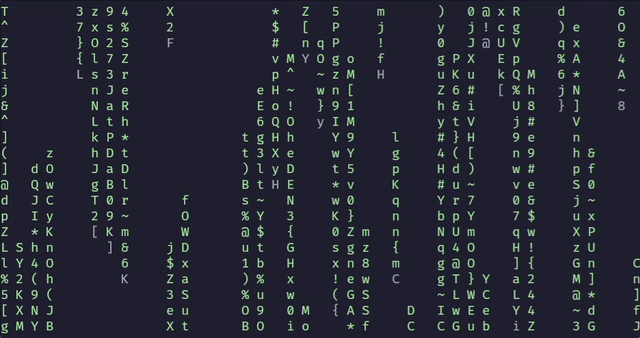

# rmatrix

rmatrix is an implementation of the [cmatrix](https://github.com/abishekvashok/cmatrix) project, but in Rust using the [ratatui crate](https://github.com/ratatui-org/ratatui).


## Installation
Someone already had the name "rmatrix", so I had to call it "rjmatrix".
```bash
cargo install rjmatrix
```

## Features
### Resize
Properly handles resizing of the terminal window both vertically and horizontally.

### Colors
Currently supports the following colors:
- red
- green
- yellow
- blue
- purple
- cyan
- rainbow

Cycle through random colors by pressing `c`.

### Speed
Change the speed the matrix falls on a scale of 1-10 (1 being the slowest and 10 being the fastest).

Cycle through the speed by pressing `0-9` (0 being the equivalent of 10).

### Direction
Change the direction the matrix falls using the arrow keys.

### Bold
Make the text bold.

## Help
```
Creates the matrix in the terminal. Use `c` to cycle colors, `0-9` to change speed, arrow keys to change direction, and `q` to quit.

Usage: rjmatrix [OPTIONS]

Options:
  -c, --color <COLOR>          Available colors: blue, cyan, red, purple, yellow, green, rainbow
  -s, --speed <SPEED>          Speed: 1-10
  -d, --direction <DIRECTION>  Direction: up, down, left, or right
  -b, --bold                   Make the text bold
  -h, --help                   Print help

```

## Future Improvements
- Add more colors
