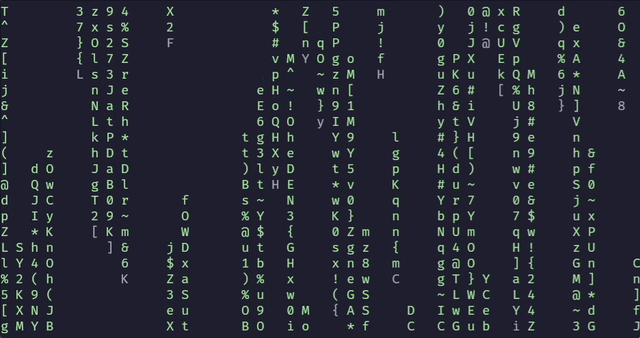

# rmatrix

rmatrix is an implementation of the [cmatrix](https://github.com/abishekvashok/cmatrix) project, but in Rust using the [ratatui crate](https://github.com/ratatui-org/ratatui).



## Installation

The crate name on crates.io is `rjmatrix` (someone took `rmatrix`).

```bash
cargo install rjmatrix
```

## Usage

```
Usage: rjmatrix [OPTIONS]

Options:
  -c, --color <COLOR>          blue, cyan, red, purple, yellow, green, rainbow
  -s, --speed <SPEED>          1 (slowest) - 10 (fastest)
  -d, --direction <DIRECTION>  up, down, left, right
  -b, --bold                   Bold text
  -h, --help                   Print help
```

### Runtime keys

| Key       | Action                              |
|-----------|-------------------------------------|
| `c`       | Cycle to a random color             |
| `0` – `9` | Change speed (`0` = fastest)        |
| `↑↓←→`    | Change direction                    |
| `b`       | Toggle bold                         |
| `q`       | Quit                                |

## Features

- Resize-aware (vertical and horizontal)
- Depth effect: streams fade from white head to dim tail using a sqrt curve over line length
- Per-stream brightness variation for layered/3D feel
- Rainbow mode picks a locked color per stream
- Bold only highlights the head

## Development

### With devenv (recommended)

This repo uses [devenv](https://devenv.sh/) + direnv to provide a reproducible Rust toolchain.

```bash
cd rmatrix
direnv allow    # one-time, after install
```

devenv will provide `rustc`, `cargo`, etc. The toolchain is pinned in `devenv.nix`.

### Without devenv

Any Rust stable toolchain >= 1.85 (required for `edition = "2024"`).

### Build & run

```bash
cargo run --release    # release mode is meaningfully smoother
cargo check            # fast type-check loop while editing
cargo build --release  # produces target/release/rjmatrix
```

### Install locally from source

```bash
cargo install --path .
```

Drops the binary in `~/.cargo/bin/rjmatrix`.

## Nix build

The repo ships a flake using `rustPlatform.buildRustPackage`. `Cargo.lock` is the only source of truth — no extra generated files.

```bash
nix build
./result/bin/rjmatrix
```

### Consuming from another flake

```nix
{
  inputs.rmatrix.url = "github:RoastBeefer00/rmatrix";
  # ...
  environment.systemPackages = [ inputs.rmatrix.packages.${system}.default ];
}
```

### Updating flake inputs

```bash
nix flake update    # bumps nixpkgs / flake-utils pins
```

## Release flow

1. Bump `version` in `Cargo.toml` and `flake.nix`
2. `cargo build --release` (sanity check)
3. `nix build` (confirm reproducible build still works)
4. Tag + push: `git tag v1.x.y && git push --tags`
5. `cargo publish`
